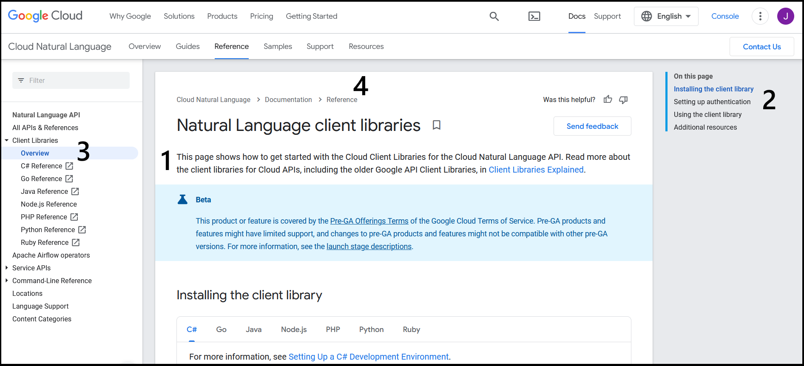

# How to Make a Docs Site: Shortcuts for Busy Devs

**Table of Contents:**
- [Introduction](#Introduction)
  * [Who This Is For](#Who-This-Is-For)
  * [What This Is](#What-This-Is)
  * [Who I am](#Who-I-Am)
- [Easy to Maintain](#Easy-to-Maintain)
  * [Docs as Code](#Docs-as-Code)
  * [Docs Tools](#Docs-Tools)
  * [Just Enough Content](#Just-Enough-Content)
- [Easy to Find](#Easy-to-Find)
  * [Information Architecture](#Information-Architecture)
  * [Types of Documentation](#Types-of-Documentation)
  * [Page Structure](#Page-Structure)
  * [SEO](#SEO)
- [Easy to Read](#Easy-to-Read)
  * [Paragraphs](#Paragraphs)
  * [Sentences](#Sentences)
  * [Vertical Lists](#Vertical-Lists)
  * [Your Reader](#Your-Reader)
- [Conclusion](#Conclusion)

## Introduction

### Who This Is For

This article is for **devs** who:
- Are new to making docs
- Want to spend as little time on research as possible 

If you want **maximum results** for **minimum effort**, then you've come to the right place. I put in the time so you don't have to.

### What This Is

This is a **short**, **practical**, and **opinionated** guide. 

You'll get the basic info you need to make a docs site that is:
- Easy to set up
- Easy to maintain
- Easy to use

You'll learn just enough about:
- Tools
- Information architecture
- SEO
- Technical writing
- Best practices

By the end of this article, you'll be ready to make your first docs site.

### Who I Am

Hi 👋 I'm Joanna Jablonski. I've been working in **developer education** since 2018. As CircleCI's first Information Architect, I planned the replatforming and restructuring of the docs site. Right now, I'm a Staff Education Engineer at CircleCI.

Feel free to reach out:
- [jojab.dev](https://www.jojab.dev)
- [GitHub](https://github.com/jablonskidev)
- [Twitter](https://twitter.com/Jo_Jablonski)
- [LinkedIn](https://www.linkedin.com/in/joanna-jablonski-14b9a7140/)

## Easy to Maintain

You can save yourself time and effort if you:
- Treat your docs like code
- Use tools that will make writing and publishing easier
- Limit the scope of your content

### Docs as Code

[Docs as Code](https://www.writethedocs.org/guide/docs-as-code/) is an approach to making docs that lets you use the tools and practices you're already using for code, such as issue trackers, version control, and automation.

You can:
- Write your docs content in a [markup language](https://en.wikipedia.org/wiki/Markup_language).
- Store those files in a [VCS](https://en.wikipedia.org/wiki/Version_control) to stay on top of changes and request reviews.
- Use a [static site generator](https://idratherbewriting.com/learnapidoc/pubapis_static_site_generators.html) to turn those markup files into HTML, CSS, and JavaScript.
- Use a [CI/CD](https://en.wikipedia.org/wiki/CI/CD) tool to build, test, and deploy.

### Docs Tools

**Which markup language should you use?**

**Short answer:** [Markdown](https://www.markdownguide.org/)

**Long answer:** Although markdown isn't as powerful as other options, it is simple and widely used. If you want to invest in learning a more powerful markup language, you can consider [AsciiDoc](https://asciidoc.org/) or [reStructuredText](https://www.sphinx-doc.org/en/master/usage/restructuredtext/basics.html). Keep in mind that not all languages can be used with all static site generators.

**Which static site generator should you use?**

**Short answer:** [Docusaurus](https://docusaurus.io/)

**Long answer:** Docusaurus is an open-source project maintained by Facebook. It's widely used and has features that are useful for docs sites, such as document versioning and Algolia search. You can use React to customize and embed components in your markdown with [MDX](https://mdxjs.com/).

Here are some other static site generators:
- [Jekyll](https://jekyllrb.com/) was popular but is now on the way out.
- [Hugo](https://gohugo.io/) builds sites quickly and is becoming more popular.
- [Sphinx](https://www.sphinx-doc.org/en/master/index.html) was built specifically for documentation and integrates with [Read the Docs](https://readthedocs.org/).

When choosing a static site generator, ask yourself:
- Does it have docs features, such as content reuse?
- Is it based on a programming language that you already use?
- Is it actively maintained by a good community?
- Does it have themes you like?

### Just Enough Content

The less documentation you have, the easier it'll be to keep it up to date:
- **Use just enough code examples:** Give code examples for the most common use cases. Avoid having so many code blocks that some will not be maintained.
- **Make content modular:** Instead of repeating the same information in multiple places, consider linking to one place that is the one source of truth for that topic. 

## Easy to Find

You can save your users time and effort if you:
- Structure your docs with their needs in mind
- Help your docs rank higher on Google

### Information Architecture

In order to plan the structure of your docs, you need to know:
- Who will be using your docs
- What your users are trying to do

For your docs structure to be effective, you need to make sure that it makes sense to the people using the product rather than the people building the product:
- **Structure your docs by task:** Your users are coming to your docs to accomplish tasks. Find out what those tasks are and make sure that there are clear and efficient [click paths](https://en.wikipedia.org/wiki/Click_path) to help your users achieve their goals quickly. For example, if your docs site is for a CI/CD product, your docs homepage could point to sections for building, testing, and deploying.
- **Use the terminology that your users do:** Find out what words they use to describe what they're trying to do. If there's terminology that's specific to your product, new users may not know it yet. If your users aren't experts, they may not think to use more specialized terminology. If they're coming from another product, they may still be using its terminology. When you decide what terminology to use, be consistent.

Consider doing a [card sort](https://www.toptal.com/designers/ia/card-sorting) with your users to see how they group tasks, terms, and concepts. A card sort can be well worth the time since it'll help you put information where your users expect it to be.

### Types of Documentation

There are four types of documentation that help your users achieve different goals in different contexts:

|                                | **Use when studying**               | **Use when working**              |
|--------------------------------|-------------------------------------|-----------------------------------|
| **Need practical steps**       | Tutorials: learning skills          | How-to guides: solving problems   |
| **Need theoretical knowledge** | Discussions: understanding concepts | Reference: looking up details     |   

If you plan your docs using these four types, then the purpose of each page will be clearer. That will make each resource easier to find and easier to maintain. To learn more, check out [Daniele Procida's talk](https://www.writethedocs.org/videos/eu/2017/the-four-kinds-of-documentation-and-why-you-need-to-understand-what-they-are-daniele-procida/).

### Page Structure

When your readers look at one of your pages, they need to quickly determine:
- Whether this page has what they need
- Where they need to go next

Help your users by including:
1. An introduction that summarizes the topic of the page and the intended audience
2. A table of contents that shows at least the h2 and h3 headings on the page
3. A sidebar to show where the page fits in the docs
4. [Breadcrumbs](https://ui-patterns.com/patterns/Breadcrumbs) at the top of the page to show where the page fits in the docs

Here's an example of a page with those elements:

### SEO

When your users have a problem, they will go to Google. It's in your best interest that your docs pages rank as high as possible.

SEO is constantly changing, but there are basic best practices:

- **Have high-quality, original content:**
    - Content that isn't duplicated on another page will rank higher.
    - Content that is well-written will rank higher.
- **Add links to your docs pages:**
    - Pages that are linked to will rank higher.
    - Pages should also link to pages outside your site.
- **Help readers spend a long time on your pages:**
    - Avoid publishing pages with very little content.
    - Consider embedding videos to increase read time.
- **Use your keyphrases:**
  - In the URL
  - In the H1
  - In at least one H2
  - In the first paragraph
  - Throughout the page, while avoiding [keyword stuffing](https://developers.google.com/search/docs/advanced/guidelines/irrelevant-keywords) 

Check out Google's [Search Engine Optimization (SEO) Starter Guide](https://developers.google.com/search/docs/beginner/seo-starter-guide). If you want to invest in an SEO tool, consider [ahrefs](https://ahrefs.com/).

## Easy to Read

You can save your readers time and effort if you:
- Make your docs easy to skim 
- Focus on your readers

### Paragraphs

Make your paragraphs easy to skim:
- **Use topic sentences:** In the first sentence, summarize the point of the paragraph. When readers skim through the page to find what they need, they'll be able to glance at the start of each paragraph to see if they're interested. Focus on one topic per paragraph. 
- **Keep paragraphs short:** Between three and five sentences per paragraph is a good goal.      
      
### Sentences

Make sentences easy to skim:
- **Keep sentences short:**
  * Cover one idea per sentence.
  * Turn long sentences into [vertical lists](#Vertical-Lists).
- **Write clearly:**
  * Use the [active voice](https://developers.google.com/tech-writing/one/active-voice).
  * Use [strong verbs](https://developers.google.com/tech-writing/one/clear-sentences#choose_strong_verbs).

### Vertical Lists

Make your vertical lists easy to skim:
- **Use parallel structure:** All of the items in your list need to look like they belong together, so structure all of them in the same way. If one list item describes an action, then all of the list items should.
- **Make your point early:** Start lists of steps with the [imperative](https://www.grammarly.com/blog/imperative-verbs/) form of a verb, such as "Open" or "Delete" rather than "Opening" or "Deleting."

### Your Reader

Focus on your reader:
- **Build sentences around the word "you":** Using "you" will help you avoid the [passive voice](https://developers.google.com/tech-writing/one/active-voice) and focus on what will help your reader.
- **Sound clear rather than smart:** Docs need to remove obstacles for users so they can see how great your product is by actually using it themselves. The more time you save your users with simple docs, the faster they'll see how sophisticated your product is. 

## Conclusion

You're ready to make an effective docs site with minimal effort! Your new docs site will be easy to set up, maintain, and use now that you know just enough about:
- Tools
- Information architecture
- SEO
- Technical writing
- Best practices

If you found this article helpful, feel free to share it and star the repo. If want to talk about developer education or developer-facing docs, feel free to reach out:
- [jojab.dev](https://www.jojab.dev)
- [GitHub](https://github.com/jablonskidev)
- [Twitter](https://twitter.com/Jo_Jablonski)
- [LinkedIn](https://www.linkedin.com/in/joanna-jablonski-14b9a7140/)
